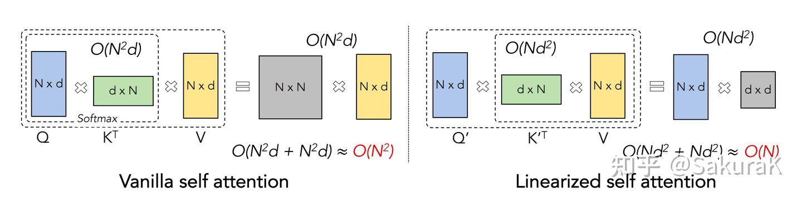
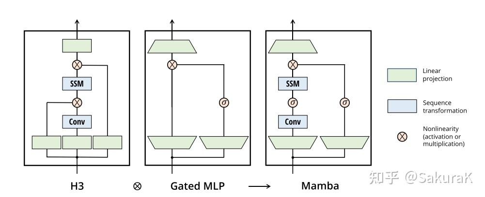
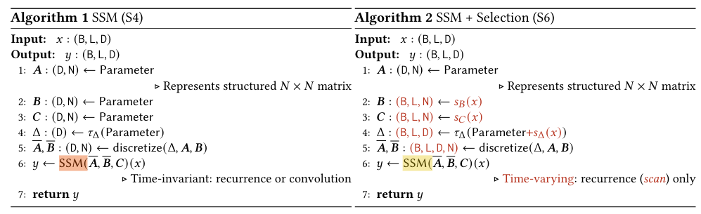
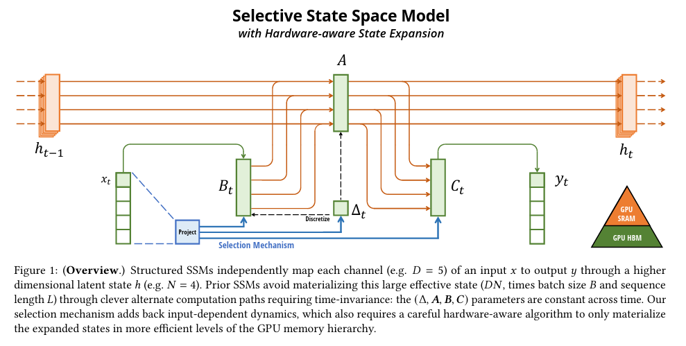

# Mamba: Linear-Time Sequence Modeling with Selective State Spaces
视频讲解：https://www.bilibili.com/video/BV1JCrVYjEPN/?spm_id_from=333.337.search-card.all.click&vd_source=438c274850337b47a0be54ae5ef6d6ca 

知乎：https://zhuanlan.zhihu.com/p/680846351

论文：https://arxiv.org/pdf/2312.00752

## 公式推导
经典的线性时不变系统，输入为$x(t)$, 系统状态为$h(t)$, 输出为$y(t)$, 系统方程（原理可参考上述视频或现代控制理论）可以表示为:

$\dot{h}(t) = Ah(t) + Bx(t)$ (1)

$y(t) = Ch(t) + Dx(t)$ (2) 

为了能够适配LLM，token by token的输出，需要对上述连续系统进行离散化，得到通过 $k$ 时刻的 $h(t_k)$ 来表达 $k+1$ 时刻的 $h(t_{k+1})$ 的方案，即 $h_{k+1}=f(h_k)$

首先观察公式 (1) ，重写为

$\dot{h}(t) - Ah(t) = Bx(t)$ (3) 

易看出函数 $F(t) = e^{-At}h(t)$，则有 $\dot{F}(t) = -Ae^{-At}h(t) + e^{-At}\dot{h}(t)$, 公式(3)两边同时乘以 $e^{-At}$ 得到：

$e^{-At}\dot{h}(t) - Ae^{-At}h(t) = e^{-At}Bx(t)$ 

因此 $\dot{F}(t) = e^{-At}Bx(t)$

易知: $F(t) = F(\lambda) + \int_\lambda^t\dot{F}(\tau)d\tau$，设 $\lambda = 0 $, 则有

$` F(t)=e^{-At}h(t)=F(0)+\int_0^te^{-A\tau}Bx(\tau)d\tau=h(0)+\int_0^te^{-A\tau}Bx(\tau)d\tau `$ (4) 

公式(4)两边同时乘以 $` e^{At} `$，可得

$` h(t)=e^{At}h(0)+e^{At}\int_0^te^{-A\tau}Bx(\tau)d\tau `$ (5) 

考虑离散化形式，令 $` t=t_{k+1} `$

$` h(t_{k+1})=e^{At_{k+1}}h(0)+e^{At_{k+1}}\int_0^{t_{k+1}}e^{-A\tau}Bx(\tau)d\tau `$ (6) 

设 $` t_{k+1}=t_k+\Delta `$, 则有

$` h(t_{k+1})=e^{A(t_k+\Delta)}h(0)+e^{A(t_k+\Delta)}[\int_0^{t_k}+\int_{t_k}^{t_{k+1}}] `$

$` h(t_{k+1})=e^{At_k}*e^{A\Delta}*h(0)+e^{At_k}*e^{A\Delta}*[\int_0^{t_k}+\int_{t_k}^{t_{k+1}}] `$

$` h(t_{k+1})=e^{A\Delta}[e^{At_k}*h(0)+e^{At_k}*\int_0^{t_k}]+e^{At_{k+1}}\int_{t_k}^{t_{k+1}}  `$ (7)

公式(7)中括号中的部分恰好等于 $` h(t_k) `$ ,化简可得

$` h(t_{k+1})=e^{A\Delta}h(t_k)+e^{At_{k+1}}\int_{t_k}^{t_{k+1}}e^{-A\tau}Bx(\tau)d\tau `$ (8)

离散场景中假设 $` \Delta `$ 足够小，我们认为 $` x(\tau) `$ 等价于 $` x(t_{k+1}) `$, 公式(8)可进一步化简：

$` h(t_{k+1})=e^{A\Delta}h(t_k)+e^{At_{k+1}}x(t_{k+1})\int_{t_k}^{t_{k+1}}e^{-A\tau}Bd\tau `$

$` h(t_{k+1})=e^{A\Delta}h(t_k)+e^{At_{k+1}}x(t_{k+1})[-\frac{1}{A}(e^{-At_{k+1}}-e^{-At_k})] `$

$` h(t_{k+1})=e^{A\Delta}h(t_k)-A^{-1}[1-e^{A\Delta}]Bx(t_{k+1}) `$ (9)

令公式(9)中 $` \bar{A}=e^{A\Delta}, \bar{B}=A^{-1}[e^{A\Delta}-1]B `$, 则有

$` h(t_{k+1})=\bar{A}h(t_k)+\bar{B}x(t_{k+1}) `$

以上得到论文中公式 (1a), (2a), (4)，对于输出，如果认为输出只与状态有关, 可以直接离散化为

$` y(t_{k+1})=Ch(t_{k+1}) `$

以上为论文中公式 (1b), (2b)

SSM 假定 $` h(t_0)=\bar{B}x(t_0) `$ , 那么当 $` k=0,1,2 `$ 时刻时，

$` y(t_0)=Ch(t_0)=C\bar{B}x(t_0) `$

$` y(t_1)=Ch(t_1)=C(\bar{A}h(t_0)+\bar{B}x(t_1))=C\bar{A}\bar{B}x(t_0)+C\bar{B}x(t_1) `$

$` y(t_2)=Ch(t_2)=C(\bar{A}h(t_1)+\bar{B}x(t_2))=C\bar{A}(\bar{A}h(t_0)+\bar{B}x(t_1))+C\bar{B}x(t_2)=C\bar{A}^2\bar{B}x(t_0)+C\bar{A}\bar{B}x(t_1)+C\bar{B}x(t_2) `$

因此

$` y_2 = [C\bar{A}^2\bar{B}, C\bar{A}\bar{B}, C\bar{B}][x_0, x_1, x_2]^T `$ (10)

当推广到第 $` k `$ 次项 $` y_k `$ 时，令 $` K=[C\bar{A}^k\bar{B}, C\bar{A}^{k-1}\bar{B}, ...], x=[x_0, x_1, ...] `$ , 则

$` y_k= K * x `$ (11)

以上为论文公式 (3a), (3b)

## 结构和维度

结构化 SSM 之所以被命名为结构化 SSM，是因为高效计算 SSM 还需要对 A 矩阵施加结构（结构化即给矩阵 A 设定一个特定的格式或模式，使得它更易于处理和优化），最常用的结构形式是对角线结构。

在此情况下， $` A \in \mathbb{R}^{N * N}, B \in \mathbb{R}^{N * 1}, C \in \mathbb{R}^{1 * N} `$
 都可以用N个数字来表示。若输入大小为 $` x \in \mathbb{R}^{B * L * D} `$ ，其中B为batch size，L为输入长度，D为输入通道数，将SSM独立应用于每个通道，每个输入的总隐藏状态维数为 $` D * N `$ ，在序列长度上它需要 $` O(BLDN) `$ 的时间和内存，这是基本效率瓶颈的来源。

## 相关 SSM 架构
SSM 是独立的序列变换，可被纳入端到端神经网络架构。(我们有时也称 SSM 架构为 SSNN，它与 SSM 层的关系就像 CNN 与线性卷积层的关系）。下面将介绍一些最著名的 SSM 架构，其中许多也将作为主要 baseline。

- Linear attention: 线性注意力，它是自注意力的近似，涉及一个递归，可以看作是一个退化的线性 SSM。

- H3: 它在S4的基础上进行了扩展；可以被看作是一种由两个门控连接夹着一个 SSM 的架构（如下图）。H3还在主SSM层之前插入了一个标准的局部卷积，将这部分定义为一个shift-SSM。

- Hyena: 使用与 H3 相同的架构，但用 MLP 参数化全局卷积取代了 S4 层。
- RetNet: 在架构中增加了一个额外的门，并使用更简单的 SSM，允许另一种可并行计算的路径，使用多头注意力（MHA）的变体来代替卷积。
- RWKV: 是最近基于另一种线性注意近似（attention-free Transformer）设计的用于语言建模的 RNN。它的主要 "WKV "机制涉及 LTI 递归，可视为两个 SSM 的比值。
- 其他的方法还有S5、QRNN、SRU等。

## 通过选择改进 SSM
将选择机制纳入模型的一种方法是，让影响序列交互的参数（如 RNN 的递归动力或 CNN 的卷积核）取决于输入。

主要做的改变就是将 $` (\Delta, A, B, C) `$ 从固定的参数变为输入的函数，同时改变张量形状。使用线性层进行，其中

$` S_B(x) = Linear_N(x), S_C(x) = Linear_N(x), S_\Delta(x) = Broadcast_D(Linear_1(x)), \tau_\Delta=softplus `$

参数现在有了一个长度维度L，意味着模型从时不变变成了时可变。这就失去了与卷积 (论文公式3) 的等价性，对效率产生了影响。

## mamba 结构

| 图中标注                    | 翻译                 |
| :---------------------- | :----------------- |
| **h\_{t-1}**            | 前一时刻隐藏状态           |
| **h\_t**                | 当前时刻隐藏状态           |
| **x\_t**                | 当前输入               |
| **y\_t**                | 当前输出               |
| **Project**             | 投影                 |
| **Selection Mechanism** | 选择机制               |
| **B\_t**                | 时刻t的B参数            |
| **C\_t**                | 时刻t的C参数            |
| **Δ\_t**                | 时刻t的Δ参数            |
| **Discretize**          | 离散化                |
| **A**                   | A矩阵（状态转移矩阵）        |
| **GPU SRAM**            | GPU静态随机存取存储器（快速内存） |
| **GPU HBM**             | GPU高带宽存储器（慢速内存）    |    

输入 $` x_t `$ → 经过Project（投影） → 生成选择机制的参数

选择机制输出：

$` B_t `$（输入依赖，绿色）

$` C_t `$（输入依赖，绿色）

$` Δ_t `$（输入依赖，蓝色虚线）

$` Δ_t `$ 经过Discretize（离散化） → 影响A矩阵

$` h_{t-1} `$（前一状态）与 $` B_t `$、$` x_t `$、$`A`$交互 → 生成$`h_t`$（当前状态）

$` h_t `$ 与 $` C_t `$ 交互 → 生成 $` y_t `$（输出）

关键特点：

橙色线：数据流（$`x_t`$ → ... → $`y_t`$）

绿色线：选择机制生成的参数（$`B_t`$, $`C_t`$）

蓝色虚线：$`Δ_t`$的离散化路径

内存层次：参数从GPU HBM（慢速）加载到GPU SRAM（快速）进行计算